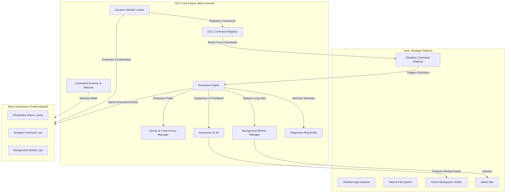
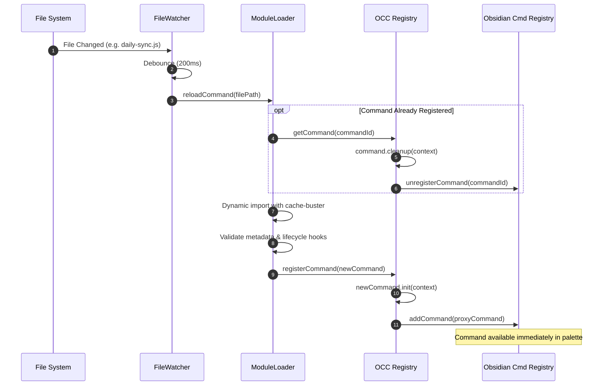
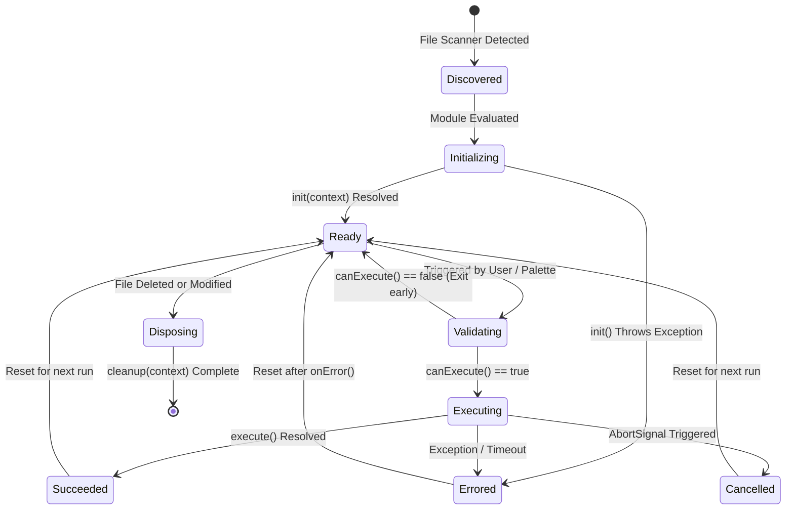
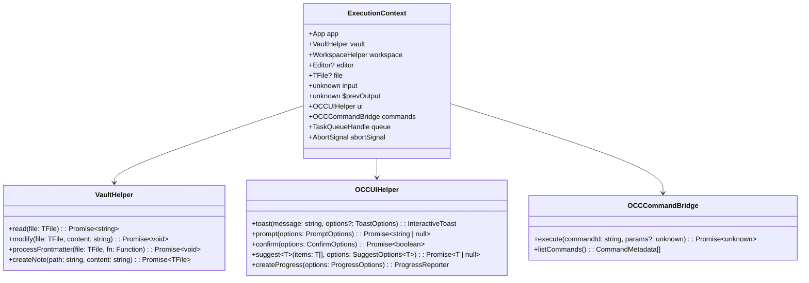
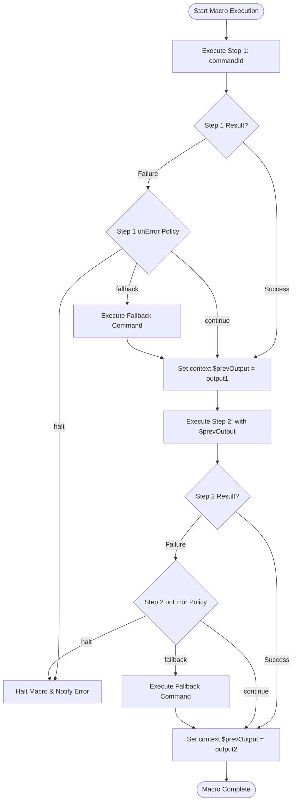
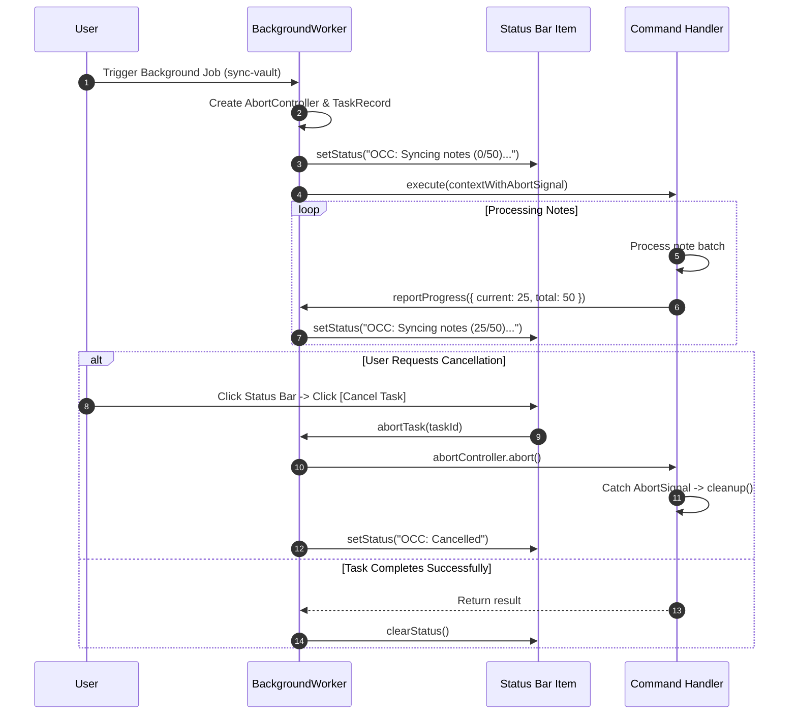
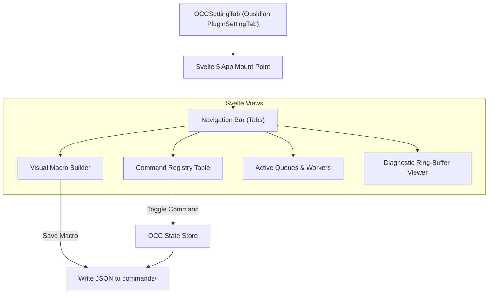
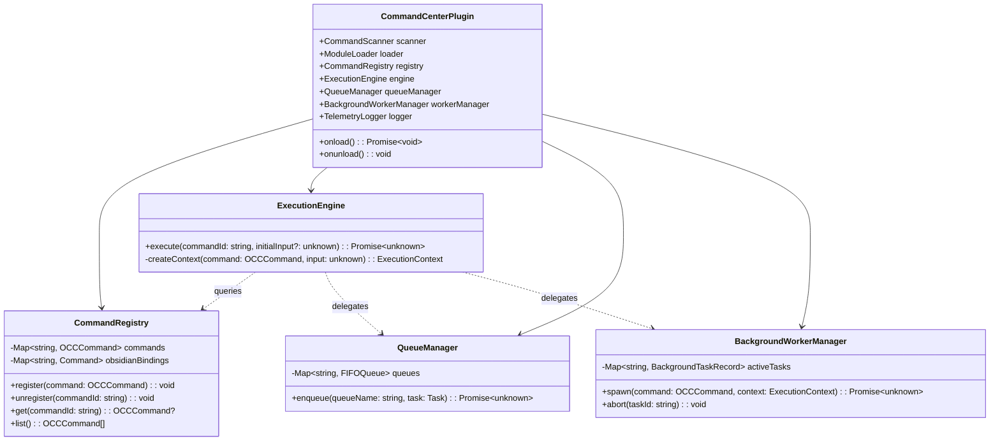

# Obsidian Command Center (OCC) — System Architecture & Design

> **Document Version:** 1.0.0  
> **Status:** Approved Architectural Baseline  
> **Target Audience:** Core Developers, Extension Authors, Architects  
> **Reference Documents:** [product.md](./product.md), [milestones.md](./milestones.md), [requirements.md](./requirements.md), [tech.md](./tech.md)  

---

## 1. System Overview & Architectural Pattern

Obsidian Command Center adopts a **Micro-Kernel (Plugin-within-a-Plugin) Architecture**. The core OCC plugin acts as a lean, immutable runtime kernel that provides:
1. **Extension Lifecycle Management** (Discovery, Validation, Binding, Hot-Reloading, Disposal).
2. **Context Bus & API Harness** (Injecting typed Obsidian and OCC helper primitives).
3. **Execution & Concurrency Orchestration** (Synchronous dispatch, FIFO queues, background tasks, debouncing).
4. **Interactive Human-in-the-Loop UI Kit** (Actionable toasts, modals, progress reporting).
5. **Observability & Fault Isolation** (Execution boundaries, watchdog timeouts, diagnostic ring-buffer).

All actual commands—whether no-code declarative macros or full-fledged TypeScript scripts—exist as external micro-extensions residing in a designated folder.



---

## 2. Core Subsystems & Design Specifications

### 2.1 Subsystem 1: Command Scanner & Dynamic Loader

Responsible for discovering command definitions, watching for file-system events, evaluating code modules, and performing zero-downtime hot-reloads ([REQ-01](./requirements.md#L27-L34), [REQ-02](./requirements.md#L38-L46), [REQ-03](./requirements.md#L49-L57)).

#### Key Classes
- `CommandScanner`: Traverses the configured commands directory recursively, filtering for `.js`, `.mjs`, and `.json` files.
- `FileWatcher`: Listens for create, modify, and delete events with a 200ms debounce buffer.
- `ModuleLoader`: Dynamically evaluates files into runtime command objects.
  - On Desktop: Employs `import("file://<path>?t=<timestamp>")` for clean module cache-busting.
  - On Mobile: Reads content via vault adapter and executes via scoped module wrappers.



---

### 2.2 Subsystem 2: Micro-Extension Contract & Lifecycle State Machine

Every command conforms to the standard `OCCCommand` contract ([REQ-04](./requirements.md#L60-L68)). Commands transition through a strict lifecycle state machine:



#### Lifecycle Interface Definition
```typescript
export interface OCCCommandMetadata {
  id: string;
  name: string;
  icon?: string;
  description?: string;
  queueName?: string;
  debounce?: number; // ms
  throttle?: number; // ms
  timeout?: number; // ms, default: 15000
  isBackground?: boolean;
}

export interface OCCCommand {
  metadata: OCCCommandMetadata;
  init?(context: ExecutionContext): Promise<void> | void;
  canExecute?(context: ExecutionContext): Promise<boolean | string> | boolean | string;
  execute(context: ExecutionContext): Promise<unknown> | unknown;
  onError?(error: Error, context: ExecutionContext): Promise<void> | void;
  cleanup?(context: ExecutionContext): Promise<void> | void;
}
```

---

### 2.3 Subsystem 3: Execution Context & Pipeline Bus

When a command is triggered, the `ExecutionEngine` constructs an isolated, contextual `ExecutionContext` ([REQ-07](./requirements.md#L95-L103), [REQ-08](./requirements.md#L106-L114)).



---

### 2.4 Subsystem 4: Native Command Bridge & Macro Pipeline

Allows declarative JSON macros to orchestrate existing Obsidian commands sequentially, passing outputs and handling step failures ([REQ-09](./requirements.md#L119-L127), [REQ-10](./requirements.md#L130-L138), [REQ-11](./requirements.md#L141-L149)).



#### Declarative Macro Format (`*.macro.json`)
```json
{
  "id": "publish-and-notify",
  "name": "Publish Note & Notify Webhook",
  "steps": [
    {
      "id": "step-1",
      "commandId": "editor:toggle-fold",
      "onError": "continue"
    },
    {
      "id": "step-2",
      "commandId": "my-scripted-webhook-poster",
      "params": { "channel": "general" },
      "onError": "halt"
    }
  ]
}
```

---

### 2.5 Subsystem 5: Concurrency, Queuing & Scheduling

Prevents data corruption or write races when multiple commands operate on identical notes or shared resources ([REQ-12](./requirements.md#L154-L162), [REQ-13](./requirements.md#L165-L173), [REQ-14](./requirements.md#L176-L184)).

```mermaid
sequenceDiagram
    autonumber
    participant Invoker as User / Trigger
    participant QM as QueueManager
    participant Queue as Named FIFO Queue ("vault-writes")
    participant Exec as ExecutionEngine
    participant Note as Target Markdown Note

    Invoker->>QM: enqueue("vault-writes", Task A)
    Invoker->>QM: enqueue("vault-writes", Task B)
    
    Note over QM,Queue: Task A begins immediately; Task B waits
    QM->>Exec: run(Task A)
    Exec->>Note: Modify Note Frontmatter
    Exec-->>QM: Task A Resolved
    
    Note over QM,Queue: Queue automatically advances to Task B
    QM->>Exec: run(Task B)
    Exec->>Note: Append Section Content
    Exec-->>QM: Task B Resolved
```

- **Debounce / Throttle Controller:** Commands triggered by rapid events (e.g., `editor-change`) are regulated via an in-memory timer map, cancelling pending timers if a new call arrives within the debounce window.

---

### 2.6 Subsystem 6: Background Worker Engine & Cancellation

Handles asynchronous tasks that execute over extended durations without blocking the UI ([REQ-15](./requirements.md#L189-L197), [REQ-16](./requirements.md#L200-L208)).



---

### 2.7 Subsystem 7: Interactive Human-in-the-Loop UI Kit

Extends Obsidian's UI primitives to provide two-way interactivity ([REQ-17](./requirements.md#L213-L221), [REQ-18](./requirements.md#L224-L232), [REQ-19](./requirements.md#L235-L243)).

#### Interactive Toast Architecture
```typescript
export interface ToastAction {
  label: string;
  variant?: "default" | "primary" | "warning" | "danger";
  onClick: (toast: InteractiveToast) => void | Promise<void>;
}

export interface ToastOptions {
  duration?: number; // 0 for persistent
  actions?: ToastAction[];
  icon?: string;
  type?: "info" | "success" | "warning" | "error";
}
```
- **Implementation:** Wraps Obsidian's native `Notice`. Injects a button bar container (`div.occ-toast-actions`) into `notice.noticeEl`, attaching click event listeners that dismiss the notice upon user selection.

#### Modal Helpers
- `prompt()`: Renders an Obsidian `Modal` with a text input, resolving with the string on Enter or `null` on Escape.
- `confirm()`: Displays an action dialog with customizable Confirm/Cancel button text and colors, resolving to a boolean.
- `suggest()`: Subclasses `SuggestModal<T>` to provide fuzzy filtering over arrays of arbitrary objects.

---

### 2.8 Subsystem 8: Settings Dashboard & Visual Macro Builder

Constructed using **Svelte 5** mounted inside `OCCSettingTab` ([REQ-20](./requirements.md#L248-L256), [REQ-21](./requirements.md#L259-L267), [REQ-22](./requirements.md#L270-L278)).



---

### 2.9 Subsystem 9: Security, Guardrails & Watchdog

Guarantees system resilience and protects user data ([REQ-25](./requirements.md#L308-L316), [REQ-26](./requirements.md#L319-L327)).

1. **Execution Watchdog:**
   - Wraps synchronous execution and Promise chains with a racing `Promise.race()` timeout timer.
   - If execution exceeds the command's timeout limit (default: 15s), the watchdog fires an `ExecutionTimeoutError`, invokes the command's `onError()` hook, and aborts any downstream pipeline steps.
2. **Safe Mode Proxy (Opt-in):**
   - In Safe Execution Mode, user scripts are wrapped in a Proxy sandbox that restricts global namespace access:
     - Disallows `child_process`.
     - Disallows direct access to Electron `remote` or `ipcRenderer`.
     - Confines filesystem mutations exclusively through the `context.vault` API.

---

## 3. Class Hierarchy & Subsystem Map



---

## 4. Traceability & Implementation Readiness

This design directly fulfills all requirements specified in [requirements.md](./requirements.md):
- **Dynamic Hot-Reloading & Lifecycle:** Subsystems 1 & 2 ([REQ-01](./requirements.md#L27-L34) - [REQ-06](./requirements.md#L82-L89))
- **Context Bus & Pipelines:** Subsystems 3 & 4 ([REQ-07](./requirements.md#L95-L103) - [REQ-11](./requirements.md#L141-L149))
- **Queuing & Concurrency:** Subsystems 5 & 6 ([REQ-12](./requirements.md#L154-L162) - [REQ-16](./requirements.md#L200-L208))
- **Interactive UI Kit:** Subsystem 7 ([REQ-17](./requirements.md#L213-L221) - [REQ-19](./requirements.md#L235-L243))
- **Dashboard & Diagnostics:** Subsystem 8 ([REQ-20](./requirements.md#L248-L256) - [REQ-22](./requirements.md#L270-L278))
- **Security & Watchdogs:** Subsystem 9 ([REQ-25](./requirements.md#L308-L316), [REQ-26](./requirements.md#L319-L327))
