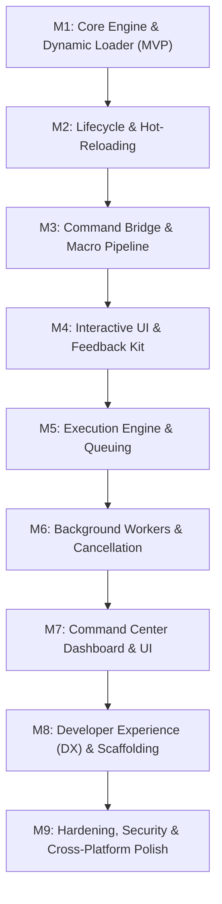

# Obsidian Command Center (OCC) — Development Milestones

> **Document Version:** 1.0.0  
> **Status:** Approved High-Level Roadmap  
> **Preparation Phase:** Pre-Requirements (EARS Specification Next)  

---

## Roadmap Overview

The development of Obsidian Command Center is organized into **9 progressive milestones**, starting with an end-to-end Minimum Viable Product (MVP) and building incrementally toward an advanced, production-grade automation runtime.

---

## Milestone Breakdown

### Milestone 1: Core Engine & Dynamic Loader (MVP)
*Establish the fundamental plugin scaffold and dynamic command execution.*
- **Goal:** Users can drop a single `.js` file or `.json` macro into a designated folder and trigger it from Obsidian's Command Palette.
- **Key Deliverables:**
  - Obsidian plugin scaffolding with TypeScript and build toolchain.
  - Configurable commands directory watcher and scanner.
  - Basic runtime evaluator for JavaScript micro-extensions and JSON definitions.
  - Dynamic registration and unregistration of commands in Obsidian’s native command palette.
  - Minimal `ExecutionContext` providing access to `app`, active file, and editor.

---

### Milestone 2: Lifecycle Engine & Zero-Downtime Hot-Reloading
*Implement the formal micro-extension contract and seamless live-reloading.*
- **Goal:** Authors can edit command files with changes instantly reflected in Obsidian without restarting the app or leaking resources.
- **Key Deliverables:**
  - Formal command lifecycle interfaces: `init`, `canExecute`, `execute`, `cleanup`, and `onError`.
  - Robust file-system watcher detecting additions, modifications, and deletions.
  - Safe reload cycle: clean up old instances, evaluate updated code, and re-bind commands.
  - Isolated error boundaries to prevent malfunctioning scripts from destabilizing Obsidian.

---

### Milestone 3: Native Command Bridge & Composable Macro Pipeline
*Enable chaining of native Obsidian commands and data pipelining.*
- **Goal:** Users can create sequential multi-step macros that pass data from one step to the next.
- **Key Deliverables:**
  - Programmatic bridge to invoke native Obsidian commands by ID.
  - Declarative macro schema supporting sequential execution of existing commands.
  - Contextual data pipeline: upstream commands yield outputs consumed downstream (`context.input` / `$prevOutput`).
  - Step-level error strategies: `halt`, `continue`, or `fallback`.

---

### Milestone 4: Interactive Feedback & Human-in-the-Loop UI
*Provide modern interactive UI primitives for command notifications and prompts.*
- **Goal:** Commands can interact with users via actionable toasts, input dialogs, and progress bars.
- **Key Deliverables:**
  - Interactive toast notifications with action buttons (e.g., `[Undo]`, `[Open Note]`, `[Retry]`).
  - Modal prompt utilities: text inputs, numbers, toggles, and fuzzy-pickers exposed via `context.ui`.
  - Visual progress indicators (determinate progress bars and indeterminate spinners) for multi-step tasks.

---

### Milestone 5: Execution Engine — Async, Queuing & Scheduling
*Manage execution flow, concurrency, and order of operations.*
- **Goal:** Prevent race conditions on vault notes and support asynchronous tasks without locking the UI.
- **Key Deliverables:**
  - Support for synchronous and asynchronous (non-blocking) command execution.
  - FIFO sequential queue for operations that must run serially on shared resources.
  - Concurrency limiter and queue priority controls.
  - Debounce and throttle execution wrappers for event-driven workflows.

---

### Milestone 6: Background Worker Engine & Cancellation
*Support long-running background tasks with live status and cancellation.*
- **Goal:** Users can fire-and-forget long operations (e.g., syncing, batch formatting) and monitor/cancel them.
- **Key Deliverables:**
  - Detached background execution harness.
  - Persistent status-bar indicator displaying active task counts and current status.
  - Cooperative cancellation support via standard `AbortController` and `AbortSignal`.
  - Task completion notifications and error alerts.

---

### Milestone 7: Command Center Dashboard & Settings UI
*Deliver a dedicated management hub and visual macro builder within Obsidian settings.*
- **Goal:** Users can inspect, toggle, configure, and assemble commands through an intuitive visual interface.
- **Key Deliverables:**
  - Command Registry table: name, ID, source file, status, execution count, and average duration.
  - Per-command enable/disable switches and manual reload triggers.
  - Real-time execution log and diagnostic trace viewer.
  - Visual Macro Builder for assembling declarative command chains without writing JSON.

---

### Milestone 8: Developer Experience (DX), Scaffolding & Type Safety
*Empower script crafters with first-class authoring tooling and documentation.*
- **Goal:** Writing custom OCC commands is frictionless, type-safe, and self-documenting.
- **Key Deliverables:**
  - Automated generation of `occ.d.ts` declaration file in the vault for IDE autocompletion.
  - Command palette generator: `Command Center: Create New Command` wizard scaffolding boilerplate.
  - Bundled library of starter templates (Daily Note Macro, Webhook Dispatcher, Batch Frontmatter Updater).
  - Developer documentation and API reference.

---

### Milestone 9: Hardening, Security, Performance & Cross-Platform Polish
*Ensure rock-solid stability, safety, and cross-platform readiness for public release.*
- **Goal:** Production-grade performance, safety guardrails, and seamless operation on Desktop and Mobile.
- **Key Deliverables:**
  - Execution timeout guards and infinite loop detection.
  - Optional sandboxing / safe execution mode restricting external system calls.
  - Performance profiling ensuring dispatch overhead remains under 5ms.
  - Mobile verification (iOS and Android touch UX, lifecycle suspension handling).
  - Release packaging, automated CI test suite, and community submission readiness.
