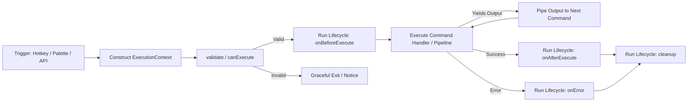

# Product Definition: Obsidian Command Center (OCC)

> **Document Version:** 1.0.0  
> **Status:** Draft / Ready for Technical Specification  
> **Target Audience:** Engineering, Product, UI/UX, and Community Extension Developers  

---

## 1. Executive Summary

**Obsidian Command Center (OCC)** is an extensible automation runtime and macro orchestration engine built for Obsidian. It bridges the gap between simple hotkey macros and heavyweight, standalone community plugins. 

Rather than requiring users to write and maintain full-fledged Obsidian plugins or juggle disparate snippets across templating engines, OCC establishes an **open-for-extension, closed-for-modification command architecture**. In OCC, **every command is a micro-extension (lightweight plugin)** that can be written, dynamically discovered, hot-reloaded, and executed with full lifecycle management, input/output piping, concurrency control, and rich interactive notifications.

```
                      +------------------------------------------+
                      |        Obsidian Command Center           |
                      |            (Core Engine)                 |
                      +------------------------------------------+
                                    |
          +-------------------------+-------------------------+
          |                         |                         |
          v                         v                         v
+-------------------+     +-------------------+     +-------------------+
| Declarative Macro |     |   Scripted Task   |     |  Background Job   |
| (JSON / Chain)    |     | (JS/TS Extension) |     |  (Async / Queue)  |
+-------------------+     +-------------------+     +-------------------+
          |                         |                         |
          +-------------------------+-------------------------+
                                    |
                                    v
          +---------------------------------------------------+
          |           Obsidian API & App Command Bus          |
          +---------------------------------------------------+
```

---

## 2. Problem Statement & Opportunities

### 2.1 The Current Landscape
Power users and knowledge workers in Obsidian regularly perform repetitive, multi-step actions, such as:
1. Opening a daily note, checking frontmatter, creating missing checklist items, and tagging tasks.
2. Generating a new project note from a prompt, moving it to a target folder, copying its markdown link, and alerting the user.
3. Fetching web metadata, sanitizing text, appending to an active editor, and firing an external webhook.

Currently, users resort to a fragmented patchwork of community tools:
- **QuickAdd / Templater**: Excellent for text templates and prompts, but cumbersome for complex command lifecycle hooks, persistent queues, background workers, or unified I/O pipelining.
- **Commander**: Great for adding commands to the UI (ribbon, status bar), but provides no native script execution pipeline, macro chaining with data dependencies, or queue management.
- **Custom JS Plugins**: Developing a standalone Obsidian plugin requires setting up Node, TypeScript, Rollup/esbuild, handling plugin registration, and submitting to the community repository—creating immense developer friction for single-purpose workflows.

### 2.2 The Solution
OCC provides a **unified meta-runtime**:
- **Zero-Build Hot-Reloading**: Drop a JavaScript/TypeScript micro-extension or JSON macro into a designated folder; OCC instantly validates, registers, and exposes it to Obsidian’s command palette without app restarts.
- **First-Class Pipeline & I/O**: Commands can yield typed outputs that feed into downstream commands or native Obsidian commands.
- **Advanced Execution Engine**: Native support for synchronous execution, asynchronous operations, background job queues, concurrency limits, and retry/rollback handlers.
- **Interactive Human-in-the-Loop Feedback**: Modern toasts and notifications with actionable buttons, interactive prompt modals, and progress tracking.

---

## 3. Core Principles & Philosophy

1. **Closed for Modification, Open for Extension:**  
   The core OCC plugin should remain lean and stable. New automations, integrations, and behaviors should be added by dropping in new command definitions, not by modifying the core codebase.
2. **Every Command is a Lightweight Plugin:**  
   A command is not just a function pointer; it is a self-contained unit with metadata, configuration schemas, lifecycle hooks (`init`, `canExecute`, `execute`, `cleanup`, `onError`), and dependencies.
3. **Composability First:**  
   Simple commands should be stitchable into larger workflows. A macro is simply a composite command running sub-commands through a managed pipeline.
4. **Non-Blocking & Asynchronous Resilience:**  
   Obsidian’s UI thread must never hang. Heavy operations run asynchronously, optionally queued or delegated to background tasks with visual progress reporting.
5. **Obsidian-Native Elegance:**  
   OCC commands must look and feel like native Obsidian commands. They register with Obsidian's command palette, respect hotkey configurations, and integrate seamlessly with the workspace, vault, and status bar.

---

## 4. User Personas

| Persona | Motivation | Primary OCC Features Used |
| :--- | :--- | :--- |
| **The Friction Reducer (No-Code User)** | Wants to bundle 2–5 existing Obsidian commands into a single hotkey macro without writing code. | Declarative JSON/YAML macro chains, UI macro builder, interactive toast confirmations. |
| **The PKM Architect (Low-Code User)** | Needs context-aware workflows (e.g., inspect frontmatter, branch logic based on folder/tag, prompt for missing attributes). | Scripted extensions with predefined OCC helper libraries (`occ.vault`, `occ.ui.prompt`), conditional branching. |
| **The Power Developer (Pro-Code User)** | Builds advanced automations (API syncing, git automation, local shell integration, database sync, background workers). | Full async micro-plugins, lifecycle hooks, background queue workers, custom interactive modals and notifications. |

---

## 5. Product Architecture & Concepts

### 5.1 The Command Hierarchy

```
[Command Definition]
  ├── Declarative Macro (YAML / JSON)
  │     ├── Sequential command IDs
  │     ├── Static / Prompted Arguments
  │     └── Error boundary behaviors (halt / continue / rollback)
  │
  └── Scripted Micro-Plugin (.js / .ts file)
        ├── Metadata (ID, Name, Icon, Hotkeys, Permissions)
        ├── Input / Parameter Schemas
        ├── Lifecycle Hooks (init, validate, execute, cleanup, onError)
        └── Exported Execution Handler
```

### 5.2 Extension Discovery & Directory Structure
Commands are stored either in the plugin’s dedicated directory or in a customizable vault directory (allowing version control via Git):

```text
<Vault>/
  └── .obsidian/
      └── plugins/
          └── obsidian-command-center/
              ├── main.js
              ├── manifest.json
              └── commands/               <-- Default Extension Directory
                  ├── daily-briefing/
                  │   ├── command.js      # Scripted micro-plugin
                  │   └── schema.json     # Optional configuration schema
                  ├── archive-task.json   # Declarative macro
                  └── sync-notes.js       # Background async task
```
*Note: Users may configure an alternate location (e.g., `<vault>/_commands/` or `<vault>/.occ/`) to keep their automations synced across devices without syncing the entire plugin directory.*

### 5.3 The Execution Pipeline & Context Bus

When a command triggers, OCC constructs an isolated `ExecutionContext`:



#### What lives in `ExecutionContext`?
- **`app`**: Obsidian's global application instance.
- **`vault`**: Enhanced vault operations (atomic reads, updates, metadata caches).
- **`workspace`**: Active leaf, active view, active editor, selection range, cursor coordinates.
- **`input`**: Data passed from a previous command, user prompts, or trigger arguments.
- **`env`**: User-defined environment variables, secrets, or plugin settings.
- **`ui`**: OCC’s interactive interface kit (toasts with action buttons, prompts, quick-pick modals).
- **`queue`**: Task queue handle for enqueueing background or delayed sub-tasks.
- **`abortSignal`**: Cancellation token for aborting long-running asynchronous tasks.

---

## 6. Functional Capabilities

### 6.1 Command Creation & Types
- **Declarative Macros:**
  - Chain existing Obsidian commands by ID (e.g., `editor:toggle-fold`, `app:open-vault`).
  - Pass static parameters or prompt the user dynamically at runtime.
  - Configure execution flow: Stop on error, ignore error, or prompt to retry.
- **Scripted Micro-Plugins:**
  - Single-file or folder-based JavaScript/TypeScript modules exporting a standard command contract.
  - Ability to import permitted standard libraries or bundle dependencies.
  - Dynamic type definitions (`occ-api.d.ts`) provided to empower authoring in VS Code or Obsidian with full autocomplete.

### 6.2 Hot Reloading & Lifecycle Hooks
- **Zero-Downtime Reloading:**
  - File watcher monitors the commands directory.
  - On file add, edit, or delete, OCC unbinds the old command instance, runs its `cleanup()` hook, re-evaluates the script, and re-registers with Obsidian's command registry in real time.
- **Contract Hooks:**
  - `init(context)`: Executed once when the command is loaded. Setup listeners or initial state.
  - `canExecute(context)`: Boolean or predicate evaluated before execution (e.g., "Is active view a Markdown file with frontmatter?"). If false, command is disabled in palette or exits early.
  - `execute(context)`: The main logic payload (sync or async).
  - `onError(error, context)`: Intercepts unhandled errors, provides custom recovery or cleanup.
  - `cleanup(context)`: Executed after run or upon plugin unload/reload to clear timers or memory leaks.

### 6.3 Queuing, Scheduling & Background Tasks
- **Execution Modes:**
  - **Synchronous:** Runs immediately in sequence; blocks downstream steps until resolved.
  - **Asynchronous (Detached / Concurrent):** Fires a promise and allows the UI/editor to remain responsive.
  - **Sequential Queue (FIFO):** Guarantees that commands modifying the same files or states execute strictly one after another without race conditions.
  - **Debounced / Throttled:** Useful for commands hooked into vault events (e.g., on note modify).
- **Background Worker Engine:**
  - Background tasks run with a persistent status item in the Obsidian status bar.
  - Supports task cancellation via standard `AbortController` signals.

### 6.4 Human-in-the-Loop Feedback: Toasts, Modals & Prompts
- **Interactive Toasts (Notice Enhancements):**
  - Standard Obsidian notices only display raw text. OCC introduces interactive toasts with:
    - Custom duration, icons, and theme accents (info, success, warning, danger).
    - Interactive action buttons (e.g., `[Undo]`, `[Open File]`, `[Retry]`).
    - Progress bars for long-running batches (e.g., "Updating 42 notes... [=====>    ] 65%").
- **Modal Prompts & Form Inputs:**
  - Rapid input prompts (text, number, date, toggle).
  - Fuzzy-search pickers populated from vault queries or API responses.
  - Multi-step wizards for complex macro initiation.

---

## 7. User Experience & User Interface

### 7.1 Command Center Settings Hub
1. **Command Registry View:**
   - Table of all detected commands (Name, ID, Source File, Type, Status: Active / Errored, Execution Count, Avg Runtime).
   - "Reload All" and "Inspect Logs" buttons.
   - Per-command toggle to enable/disable without deleting files.
2. **Visual Macro Builder (For No-Code Users):**
   - Drag-and-drop step sequencer to build declarative chains without writing JSON.
   - Selector for choosing native Obsidian commands from an autocomplete dropdown.
   - Inline configuration of prompts and fallbacks.
3. **Queue & Background Task Inspector:**
   - Live view of pending, active, and completed background tasks.
   - Ability to cancel stuck tasks or view execution traces.

### 7.2 Developer Experience (DX)
- **Built-in Command Scaffolder:**
  - OCC Command Palette action: `Command Center: Create New Command`.
  - Prompts for command name and type (Macro vs. Script), generating a starter template directly in the commands folder.
- **Type Safety & Intellisense:**
  - Generation of `occ.d.ts` in the vault root or plugin directory for IDE autocompletion.
- **Diagnostic Logging:**
  - Dedicated debug console / execution log inside Obsidian modal or dev tools detailing step execution times, input/output dumps, and error stack traces.

---

## 8. Non-Functional Requirements & System Constraints

- **Performance:**
  - Command invocation overhead must be negligible (< 5ms dispatch time for micro-plugins).
  - Background queues must yield cycles back to Obsidian's main thread to prevent frame drops during editor typing.
- **Reliability & Isolation:**
  - A crash or unhandled promise rejection in one command must never crash the Obsidian host application or corrupt other registered commands.
  - Sandboxed memory cleanup to prevent memory leaks across repeated hot-reloads.
- **Security:**
  - Scripts execute with full local JavaScript privileges (standard in Obsidian plugins). However:
    - Display explicit warnings when loading external or unverified scripts.
    - Provide an opt-in "Safe Execution Mode" that restricts direct Node `child_process` or filesystem calls outside the vault.
- **Cross-Platform Compatibility:**
  - Desktop (macOS, Windows, Linux) first-class support.
  - Mobile compatibility (iOS / Android) consideration: Mobile devices have sandbox and performance restrictions; background queues must respect mobile OS suspend states.

---

## 9. Non-Goals (Out of Scope for v1)

- **Not a Complete Text Editor:** OCC will not implement text formatting palettes or custom markdown parsers; it interacts with the active editor via the Obsidian Editor API.
- **Not a Visual Node-Graph Programming System:** OCC is focused on linear pipelines, scripts, and queues. Visual node-based workflow canvases (like n8n or Node-RED) are out of scope for v1.
- **Not a Package Manager:** OCC v1 will not host a public package registry for 3rd-party community commands. Users share scripts via GitHub, Gist, or direct file transfer.

---

## 10. Success Metrics

1. **Velocity of Automation:** Users can create and run a working multi-step macro in under 2 minutes using the UI, or build a custom script in under 5 minutes.
2. **Execution Reliability:** Zero Obsidian UI freezes caused by synchronous command locks or unhandled queue exceptions.
3. **Ecosystem Extensibility:** Developers can publish standalone `.js` scripts that work immediately across any vault running OCC without code changes to OCC core.
4. **Community Adoption:** Power users migrate legacy, fragile custom JS snippets into cleanly structured OCC micro-plugins.

---

## 11. Next Steps & Artifact Roadmap

1. **`spec.md` (Technical Specification):**
   - Detailed API contract for `ExecutionContext`, `OCCCommand`, and lifecycle hooks.
   - Execution pipeline specification (Data Bus, Queuing algorithm, Abort signals).
   - Dynamic module loader & hot-reload engine architecture.
2. **`design.md` (System & UI/UX Design):**
   - Component diagrams, State machine models, UI wireframes for Command Hub & Interactive Toasts.
3. **`roadmap.md` & `tasks.md`:**
   - Phased milestones (Phase 1: Core Engine & Loader; Phase 2: Macro Builder & UI; Phase 3: Queues & Workers).
   - Granular breakdown of implementation tasks.
4. **Implementation & Verification:**
   - Initial project scaffolding (TypeScript, esbuild/Rollup, Obsidian API mocks, unit & integration tests).
