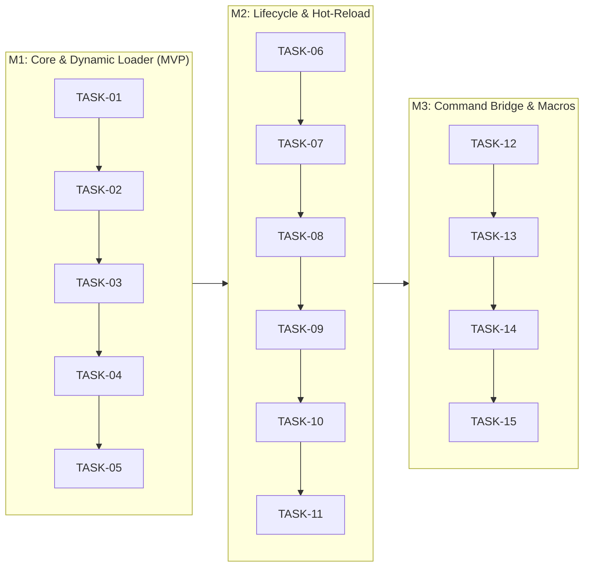

# Obsidian Command Center (OCC) — Implementation Tasks

> **Document Version:** 1.0.0  
> **Status:** Ready for Sprint Planning & Execution  
> **Reference Documents:** [product.md](./product.md), [milestones.md](./milestones.md), [requirements.md](./requirements.md), [tech.md](./tech.md), [design.md](./design.md)  

---

## Task Matrix & Acceptance Criteria Traceability

---

## Milestone 1: Core Engine & Dynamic Loader (MVP)

- [x] **TASK-01: Plugin Project Scaffolding & Build Toolchain**
  - **Implementation Steps:**
    1. Initialize `package.json` with TypeScript 5.4+, `obsidian`, `esbuild`, and `vitest`.
    2. Create `tsconfig.json` configured for `ES2022`, strict type checking, and isolated modules.
    3. Configure `esbuild.config.mjs` for bundling `main.js` in CommonJS format with sourcemap support.
    4. Create base Obsidian plugin class `CommandCenterPlugin` extending `Plugin`.
    5. Implement base Vitest test environment with mock Obsidian `App` fixtures.
  - **Acceptance Criteria:** Prerequisite foundation for [REQ-01.1](./requirements.md#L32), [REQ-07.1](./requirements.md#L100).

- [x] **TASK-02: Commands Directory Scanner**
  - **Implementation Steps:**
    1. Implement `CommandScanner` class to read the commands directory using `app.vault.adapter`.
    2. Support the default path (`.obsidian/plugins/obsidian-command-center/commands/`) and user-configured paths.
    3. Implement recursive traversal to detect single-file scripts (`*.js`, `*.mjs`, `*.json`) and folders with `command.js` or `index.js`.
    4. Emit a normalized list of command file descriptors.
  - **Acceptance Criteria:** [REQ-01.1](./requirements.md#L32), [REQ-01.2](./requirements.md#L33).

- [x] **TASK-03: Dynamic Module Evaluator & Validator**
  - **Implementation Steps:**
    1. Implement `ModuleLoader` class.
    2. On Desktop, implement dynamic `import()` using `file://` URLs with cache-busting timestamp queries (`?t=${Date.now()}`).
    3. On Mobile, implement fallback evaluator using `app.vault.adapter.read()` and scoped function evaluation.
    4. Validate imported modules to ensure required `metadata.id` and `metadata.name` properties are present.
  - **Acceptance Criteria:** [REQ-01.1](./requirements.md#L32), [REQ-01.3](./requirements.md#L34).

- [x] **TASK-04: Dynamic Command Palette Registration**
  - **Implementation Steps:**
    1. Implement `CommandRegistry` class to manage in-memory registered commands.
    2. Register discovered commands with Obsidian via `plugin.addCommand()`.
    3. Bind proxy callbacks to route command invocation to the execution engine.
    4. Implement clean unregistration from Obsidian's internal command bus when commands are unloaded.
  - **Acceptance Criteria:** [REQ-01.3](./requirements.md#L34), [REQ-03.1](./requirements.md#L54).

- [x] **TASK-05: Minimal Execution Context Construction**
  - **Implementation Steps:**
    1. Implement `ExecutionContextImpl` providing references to `app`, active `editor`, and active `file`.
    2. Implement `VaultHelper` with atomic file reading and writing utilities.
    3. Wire the execution pipeline so calling a registered command instantiates the context and calls `execute(context)`.
  - **Acceptance Criteria:** [REQ-07.1](./requirements.md#L100), [REQ-07.2](./requirements.md#L101), [REQ-07.3](./requirements.md#L102).

---

## Milestone 2: Lifecycle Engine & Zero-Downtime Hot-Reloading

- [x] **TASK-06: File System Watcher & Event Debouncer**
  - **Implementation Steps:**
    1. Implement `FileWatcher` class monitoring the commands directory.
    2. Hook into Obsidian vault adapter change events or Node `fs.watch`.
    3. Implement a 200ms debounce buffer to coalesce rapid disk write events.
    4. Dispatch granular change events (`CREATE`, `MODIFY`, `DELETE`) to the reload manager.
  - **Acceptance Criteria:** [REQ-02.1](./requirements.md#L43).

- [x] **TASK-07: Micro-Extension Lifecycle State Machine**
  - **Implementation Steps:**
    1. Implement lifecycle coordinator supporting `init`, `canExecute`, `execute`, `cleanup`, and `onError`.
    2. Ensure `init(context)` executes immediately upon command registration.
    3. Ensure `cleanup(context)` executes prior to reloading or disposing a command.
    4. Register global plugin unload handler to trigger `cleanup()` across all active commands.
  - **Acceptance Criteria:** [REQ-04.1](./requirements.md#L65), [REQ-04.2](./requirements.md#L66), [REQ-04.3](./requirements.md#L67).

- [x] **TASK-08: Zero-Downtime Hot-Reload & Hotkey Preservation**
  - **Implementation Steps:**
    1. On `MODIFY` event, query Obsidian's hotkey manager for existing user-assigned shortcuts for the target command ID.
    2. Invoke the old command instance's `cleanup(context)`.
    3. Re-evaluate the module using an updated cache-busting timestamp.
    4. Re-bind the command in Obsidian, restoring the cached hotkey mapping.
  - **Acceptance Criteria:** [REQ-02.2](./requirements.md#L44), [REQ-02.3](./requirements.md#L45).

- [x] **TASK-09: Dynamic Command Removal**
  - **Implementation Steps:**
    1. On `DELETE` event, locate the registered command in `CommandRegistry`.
    2. Invoke `cleanup(context)` and cancel any pending queued or background tasks.
    3. Remove command from Obsidian's `app.commands.commands` map.
    4. Remove command entry from the in-memory registry table.
  - **Acceptance Criteria:** [REQ-03.1](./requirements.md#L54), [REQ-03.2](./requirements.md#L55), [REQ-03.3](./requirements.md#L56).

- [x] **TASK-10: Pre-Execution Context Validation (`canExecute`)**
  - **Implementation Steps:**
    1. In `ExecutionEngine`, invoke `canExecute(context)` before calling `execute()`.
    2. Halt execution if `canExecute` returns `false` or rejects.
    3. If `canExecute` returns a string explanation, display a non-intrusive warning notice explaining why the command was blocked.
    4. Default to `true` if `canExecute` is not defined on the command.
  - **Acceptance Criteria:** [REQ-05.1](./requirements.md#L76), [REQ-05.2](./requirements.md#L77), [REQ-05.3](./requirements.md#L78).

- [x] **TASK-11: Error Boundary & Fault Isolation Engine**
  - **Implementation Steps:**
    1. Wrap command invocation in an isolated `try/catch` and Promise rejection listener.
    2. Catch unhandled errors and dispatch to `command.onError(error, context)`.
    3. Log full stack trace to the diagnostic telemetry buffer.
    4. Display an error toast to the user with a copyable error summary.
    5. Ensure uncaught errors never bubble to Obsidian host or crash other commands.
  - **Acceptance Criteria:** [REQ-06.1](./requirements.md#L87), [REQ-06.2](./requirements.md#L88), [REQ-06.3](./requirements.md#L89).

---

## Milestone 3: Native Command Bridge & Composable Macro Pipeline

- [x] **TASK-12: Native Obsidian Command Bridge**
  - **Implementation Steps:**
    1. Implement `OCCCommandBridge` class exposed on `context.commands`.
    2. Implement `execute(commandId, params)` mapping to `app.commands.executeCommandById(commandId)`.
    3. Validate command ID presence in `app.commands.commands`.
    4. Throw `CommandNotFoundError` with descriptive message if command is missing.
  - **Acceptance Criteria:** [REQ-09.1](./requirements.md#L124), [REQ-09.2](./requirements.md#L125), [REQ-09.3](./requirements.md#L126).

- [x] **TASK-13: Declarative Macro Parser & Sequential Runner**
  - **Implementation Steps:**
    1. Define JSON schema for `*.macro.json` files.
    2. Implement `MacroOrchestrator` to parse and validate macro definitions.
    3. Iterate through declared steps sequentially using `for...of` loops, awaiting step completion.
    4. Register macro in Obsidian command palette under declared `name` and `id`.
  - **Acceptance Criteria:** [REQ-10.1](./requirements.md#L135), [REQ-10.2](./requirements.md#L136), [REQ-10.3](./requirements.md#L137).

- [x] **TASK-14: Sequential Output Piping & Data Bus**
  - **Implementation Steps:**
    1. Capture return value of step $N$ in the macro runner.
    2. Supply return value as `context.input` and `context.$prevOutput` to step $N+1$.
    3. Maintain historical step outputs in `context.steps[index].output`.
    4. Preserve primitive types and serializable objects across the pipe.
  - **Acceptance Criteria:** [REQ-08.1](./requirements.md#L111), [REQ-08.2](./requirements.md#L112), [REQ-08.3](./requirements.md#L113).

- [x] **TASK-15: Macro Step Fallback & Error Policy Engine**
  - **Implementation Steps:**
    1. Implement step-level error handling evaluating `onError: "halt" | "continue" | "fallback"`.
    2. If `halt`, abort macro execution immediately and display an error notice.
    3. If `continue`, log the step error and advance to the next step.
    4. If `fallback`, execute `fallbackCommandId` prior to proceeding.
  - **Acceptance Criteria:** [REQ-11.1](./requirements.md#L146), [REQ-11.2](./requirements.md#L147), [REQ-11.3](./requirements.md#L148).

---

## Milestone 4: Interactive Feedback & Human-in-the-Loop UI

- [x] **TASK-16: Interactive Action Toast Component**
  - **Implementation Steps:**
    1. Implement `InteractiveToast` wrapping Obsidian's native `Notice`.
    2. Inject action button container (`div.occ-toast-actions`) into `noticeEl`.
    3. Attach click event listeners executing user callbacks (e.g. `[Undo]`, `[Retry]`).
    4. Support persistent toasts (`duration: 0`) and automatic dismissal on action click.
  - **Acceptance Criteria:** [REQ-17.1](./requirements.md#L218), [REQ-17.2](./requirements.md#L219), [REQ-17.3](./requirements.md#L220).

- [x] **TASK-17: Modal Prompt Utilities (`prompt`, `confirm`, `suggest`)**
  - **Implementation Steps:**
    1. Implement `PromptModal` extending `Modal` for text input with Enter-to-submit and Escape-to-cancel.
    2. Implement `ConfirmModal` providing configurable Confirm and Cancel buttons, returning a boolean.
    3. Implement `SuggestPickerModal` extending `SuggestModal<T>` for fuzzy searching arbitrary item arrays.
    4. Expose all methods cleanly on `context.ui`.
  - **Acceptance Criteria:** [REQ-18.1](./requirements.md#L229), [REQ-18.2](./requirements.md#L230), [REQ-18.3](./requirements.md#L231).

- [x] **TASK-18: Batch Progress Indicator**
  - **Implementation Steps:**
    1. Implement `ProgressReporter` with `update({ current, total, message })` and `finish()`.
    2. Render progress bar inside an interactive toast or status bar item.
    3. Throttle progress DOM updates to 60fps to prevent render thrashing during high-frequency loops.
    4. Automatically dismiss progress widget and show final completion notice on `finish()`.
  - **Acceptance Criteria:** [REQ-19.1](./requirements.md#L240), [REQ-19.2](./requirements.md#L241), [REQ-19.3](./requirements.md#L242).

---

## Milestone 5: Execution Engine — Async, Queuing & Scheduling

- [ ] **TASK-19: Non-Blocking Asynchronous Runner**
  - **Implementation Steps:**
    1. Implement Promise-based asynchronous command runner.
    2. Expose `context.yield()` helper executing `new Promise(resolve => setTimeout(resolve, 0))` to relinquish main thread.
    3. Verify active editor keystrokes and typing responsiveness are maintained during async task execution.
  - **Acceptance Criteria:** [REQ-12.1](./requirements.md#L159), [REQ-12.2](./requirements.md#L160), [REQ-12.3](./requirements.md#L161).

- [ ] **TASK-20: Named Serial FIFO Queue Manager**
  - **Implementation Steps:**
    1. Implement `QueueManager` and `FIFOQueue` linked list data structure.
    2. Route commands declaring `queueName` to the designated queue.
    3. Guarantee strict one-at-a-time serial execution per named queue.
    4. Support `haltOnError: true` to pause or abort pending queue items on failure.
  - **Acceptance Criteria:** [REQ-13.1](./requirements.md#L170), [REQ-13.2](./requirements.md#L171), [REQ-13.3](./requirements.md#L172).

- [ ] **TASK-21: Debounce & Throttle Scheduler**
  - **Implementation Steps:**
    1. Implement `DebounceThrottleManager` maintaining in-memory timer handles.
    2. Intercept commands with `metadata.debounce` to delay execution until quiet period elapses.
    3. Intercept commands with `metadata.throttle` to limit execution frequency.
    4. Implement `context.cancelDebounce()` to cancel scheduled invocations.
  - **Acceptance Criteria:** [REQ-14.1](./requirements.md#L181), [REQ-14.2](./requirements.md#L182), [REQ-14.3](./requirements.md#L183).

---

## Milestone 6: Background Worker Engine & Cancellation

- [ ] **TASK-22: Background Worker Execution Runner**
  - **Implementation Steps:**
    1. Implement `BackgroundWorkerManager` to run detached async commands (`metadata.isBackground: true`).
    2. Maintain an in-memory map of `BackgroundTaskRecord` instances.
    3. Update worker lifecycle state (`PENDING`, `RUNNING`, `CANCELLED`, `COMPLETED`, `FAILED`).
  - **Acceptance Criteria:** [REQ-15.1](./requirements.md#L194), [REQ-15.3](./requirements.md#L196).

- [ ] **TASK-23: Status Bar Monitor & Task Inspector Modal**
  - **Implementation Steps:**
    1. Register an OCC item in the Obsidian status bar.
    2. Display dynamic status text and task counts when background jobs run.
    3. Clicking the status bar opens the Task Inspector modal.
    4. Task Inspector displays active tasks, runtime durations, and cancellation buttons.
  - **Acceptance Criteria:** [REQ-15.1](./requirements.md#L194), [REQ-15.2](./requirements.md#L195).

- [ ] **TASK-24: Cooperative Task Cancellation (`AbortSignal`)**
  - **Implementation Steps:**
    1. Instantiate an `AbortController` for each spawned background task.
    2. Inject `abortController.signal` into `context.abortSignal`.
    3. Wire the "Cancel" action in the Task Inspector to call `abortController.abort()`.
    4. Update task state to `CANCELLED` and invoke `command.cleanup(context)`.
  - **Acceptance Criteria:** [REQ-16.1](./requirements.md#L205), [REQ-16.2](./requirements.md#L206), [REQ-16.3](./requirements.md#L207).

---

## Milestone 7: Command Center Dashboard & Settings UI

- [ ] **TASK-25: Settings Tab & Svelte 5 Mount Point**
  - **Implementation Steps:**
    1. Implement `OCCSettingTab` extending `PluginSettingTab`.
    2. Mount the Svelte 5 root application into `containerEl`.
    3. Implement tab navigation (Commands, Macro Builder, Queues, Logs).
    4. Cleanly unmount Svelte application when the settings tab is closed.
  - **Acceptance Criteria:** [REQ-20.1](./requirements.md#L253), [REQ-20.2](./requirements.md#L254).

- [ ] **TASK-26: Command Registry Table View**
  - **Implementation Steps:**
    1. Create `CommandTable.svelte` rendering Name, ID, Source File, Type, and Status.
    2. Implement enable/disable toggles updating plugin settings and command bindings.
    3. Add a "Reload Commands" button triggering an immediate rescan.
    4. Render error badges and failure callouts for broken commands.
  - **Acceptance Criteria:** [REQ-20.1](./requirements.md#L253), [REQ-20.2](./requirements.md#L254), [REQ-20.3](./requirements.md#L255).

- [ ] **TASK-27: Visual Macro Builder UI**
  - **Implementation Steps:**
    1. Create `MacroBuilder.svelte` with a reorderable step list.
    2. Integrate autocomplete search for native Obsidian commands.
    3. Provide UI controls for step parameters and error policies (`halt`, `continue`, `fallback`).
    4. Implement "Save Macro" button serializing configuration directly to `*.macro.json`.
  - **Acceptance Criteria:** [REQ-21.1](./requirements.md#L264), [REQ-21.2](./requirements.md#L265), [REQ-21.3](./requirements.md#L266).

- [ ] **TASK-28: Diagnostic Telemetry & Execution Log Viewer**
  - **Implementation Steps:**
    1. Implement 100-entry in-memory ring-buffer recording execution events.
    2. Create `LogViewer.svelte` rendering timestamp, command ID, duration, and status.
    3. Add search input and status filter dropdowns.
    4. Add "Copy Diagnostics" button copying sanitized JSON logs to the clipboard.
  - **Acceptance Criteria:** [REQ-22.1](./requirements.md#L275), [REQ-22.2](./requirements.md#L276), [REQ-22.3](./requirements.md#L277).

---

## Milestone 8: Developer Experience (DX), Scaffolding & Type Safety

- [ ] **TASK-29: Automated Type Definition Generator (`occ.d.ts`)**
  - **Implementation Steps:**
    1. Implement `TypeDefinitionGenerator` bundling the complete OCC API typings.
    2. Generate `occ.d.ts` in the commands directory on plugin startup.
    3. Include typings for `ExecutionContext`, `OCCCommand`, `ToastOptions`, and `TaskQueueHandle`.
    4. Ensure file write is atomic and non-destructive to user scripts.
  - **Acceptance Criteria:** [REQ-23.1](./requirements.md#L288), [REQ-23.2](./requirements.md#L289), [REQ-23.3](./requirements.md#L290).

- [ ] **TASK-30: Interactive Command Scaffolder Wizard**
  - **Implementation Steps:**
    1. Register Obsidian command `Command Center: Create New Command`.
    2. Prompt user for command name via `context.ui.prompt()`.
    3. Prompt user for command type (Script vs. Macro) via `context.ui.suggest()`.
    4. Generate slugified filename and populate boilerplate starter code.
    5. Automatically open the newly created file in an active editor tab.
  - **Acceptance Criteria:** [REQ-24.1](./requirements.md#L299), [REQ-24.2](./requirements.md#L300), [REQ-24.3](./requirements.md#L301), [REQ-24.4](./requirements.md#L302).

- [ ] **TASK-31: Starter Command Template Library**
  - **Implementation Steps:**
    1. Bundle three production-ready starter templates:
       - `daily-briefing.js`: Inspects frontmatter and appends tasks.
       - `format-and-export.macro.json`: Formats note and triggers export command.
       - `sync-notes-worker.js`: Background task with progress bar and cancellation.
    2. Add "Install Starter Templates" button in settings tab.
  - **Acceptance Criteria:** [REQ-24.2](./requirements.md#L300), [REQ-24.3](./requirements.md#L301).

---

## Milestone 9: Hardening, Security, Performance & Cross-Platform Polish

- [ ] **TASK-32: Execution Watchdog & Timeout Guard**
  - **Implementation Steps:**
    1. Implement `ExecutionWatchdog` racing execution against a configurable timeout (default 15s).
    2. If timeout expires, abort the command and throw `ExecutionTimeoutError`.
    3. Invoke `command.onError()` and display a timeout warning toast.
    4. Exempt background workers from synchronous timeouts.
  - **Acceptance Criteria:** [REQ-25.1](./requirements.md#L313), [REQ-25.2](./requirements.md#L314), [REQ-25.3](./requirements.md#L315).

- [ ] **TASK-33: Safe Execution Sandboxing Proxy**
  - **Implementation Steps:**
    1. Implement opt-in Safe Execution Mode toggle in settings.
    2. In Safe Mode, wrap script evaluation in a Proxy sandbox masking Node `child_process`.
    3. Intercept unauthorized filesystem calls outside the Obsidian vault.
    4. Throw `SecurityViolationError` upon unauthorized access attempts.
  - **Acceptance Criteria:** [REQ-26.1](./requirements.md#L324), [REQ-26.2](./requirements.md#L325), [REQ-26.3](./requirements.md#L326).

- [ ] **TASK-34: Performance Benchmarking & Dispatch Profiling**
  - **Implementation Steps:**
    1. Build automated benchmark suite measuring command dispatch overhead.
    2. Verify dispatch overhead is strictly below 5ms.
    3. Verify memory footprint per loaded command is under 50KB.
    4. Profile hot-reload cycles to ensure zero memory leaks across 100 consecutive reloads.
  - **Acceptance Criteria:** [REQ-12.1](./requirements.md#L159), [REQ-12.3](./requirements.md#L161).

- [ ] **TASK-35: Mobile Compatibility Verification & Touch Polish**
  - **Implementation Steps:**
    1. Test script evaluation on mobile runtime via `app.vault.adapter`.
    2. Adapt interactive toast buttons and modals for mobile touch hit targets (minimum 44x44px).
    3. Hook into mobile app lifecycle events (`pause`, `resume`) to suspend queues appropriately.
  - **Acceptance Criteria:** [REQ-01.1](./requirements.md#L32), [REQ-15.3](./requirements.md#L196), [REQ-17.1](./requirements.md#L218).

- [ ] **TASK-36: Release Packaging & Automated CI Test Suite**
  - **Implementation Steps:**
    1. Set up GitHub Actions CI workflow running typecheck, linter, and Vitest suite.
    2. Create automated release pipeline generating `manifest.json`, `main.js`, and `styles.css`.
    3. Prepare community plugin submission documentation and release notes.
  - **Acceptance Criteria:** Fulfills verification for [REQ-01](./requirements.md#L27-L34) through [REQ-26](./requirements.md#L319-L327).
